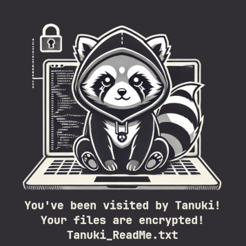

# Tanuki 🦝
### Ransomware Simulation Script
Simulates TTPs of a made-up ransomware group named Tanuki.

Intended for use with PowerShell 7 on an AD server (virtual machine) that can be restored to snapshot.

The PWSH script performes the following actions when launched:
1. Checks if script was executed as Administrator
2. Creates a log file in the path of the executed script
3. Creates the directories "C:\AtomicRedTeam\ExternalPayloads"
4. Excludes "C:\AtomicRedTeam" in Microsoft Defender
5. Installs and enables Atomic Red Team
6. Simulates ransomware attack by executing a set of Atomic Red Team tests
7. Creates 100 files with extension .tanuki, ransom note and replaces the desktop wallpaper
 
### Tactics, Techniques, and Procedures (TTPs)
| **Tactic**          | **Technique**                                                | **Sub-techniques or Tools**                                  |
| ------------------- | ------------------------------------------------------------ | ------------------------------------------------------------ |
| Initial Access      | N/A                                                          | N/A                                                          |
| Discovery           | T1033: System Owner/User Discovery T1069: Permission Groups Discovery T1046: Network Service Discovery T1135: Network Share Discovery | T1069.001 - Basic Permission Groups Discovery Windows (Local) T1069.002 - Basic Permission Groups Discovery Windows (Domain) Advanced IP Scanner SharpShares |
| Lateral Movement    | T1021: Remote Services                                       | T1021.001 - Remote Desktop Protocol (RDP)                    |
| Collection          | T1560: Archive Collected Data                                | T1560.001 - Using WinRAR to archive data prior to exfiltration |
| Command and Control | T1219: Remote Access Software                                | AnyDesk                                                      |
| Exfiltration        | T1567: Exfiltration Over Web Service                         | T1567.002 - Exfiltrate data with rclone to cloud Storage - Mega |
| Credential Access   | T1003: OS Credential Dumping T1555: Credentials from Password Stores | T1003.001 - OS Credential Dumping: LSASS Memory - with Mimikatz T1555.003 - Dump Credentials using Lazagne |
| Persistence         | T1136: Create Account T1053: Scheduled Task/Job         | T1136.002 - Create Account: Domain Account T1053.005 - Scheduled Task Startup Script |
| Execution           | T1569: System Services T1559: Inter-Process Communication | T1569.002 - Service Execution (PsExec) Cobalt Strike usage |
| Defense Evasion     | T1564: Hide Artifacts T1562: Impair Defenses            | T1564.012 - File/Path Exclusions (Windows Defender) T1562.001 - Disable or Modify Tools (Windows Defender/AV) T1562.004 - Disable Microsoft Defender Firewall via Registry |
| Impact              | T1486: Data Encrypted for Impact T1490: Inhibit System Recovery T1491.001 - Defacement: Internal Defacement | Creates "encrypted" files with .tanuki file extension T1490 - Windows - Delete Volume Shadow Copies with Powershell Replace desktop wallpaper |

PowerShell script based on ransomware simulation scripts by https://github.com/skandler
